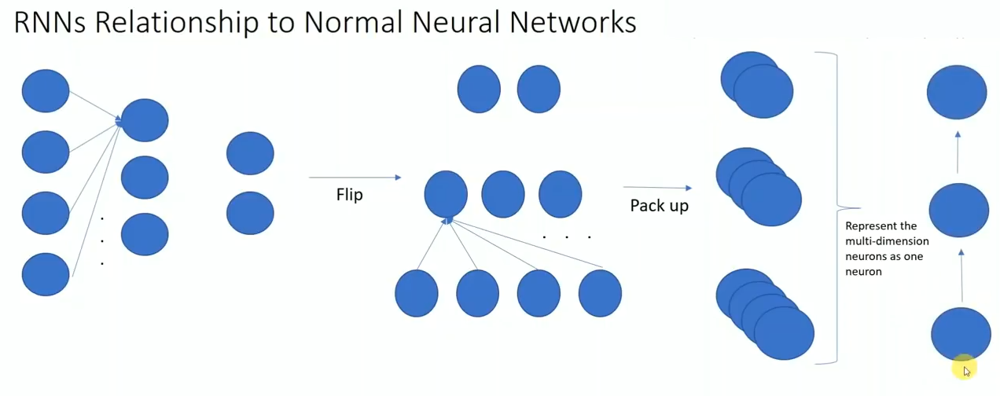
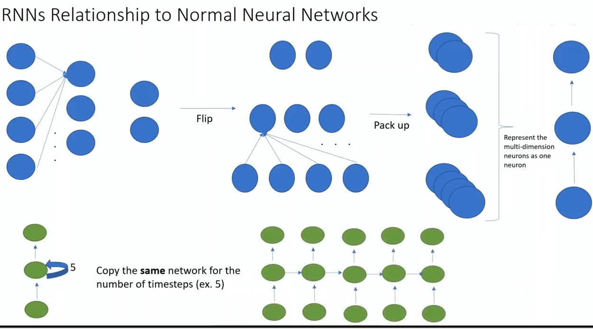
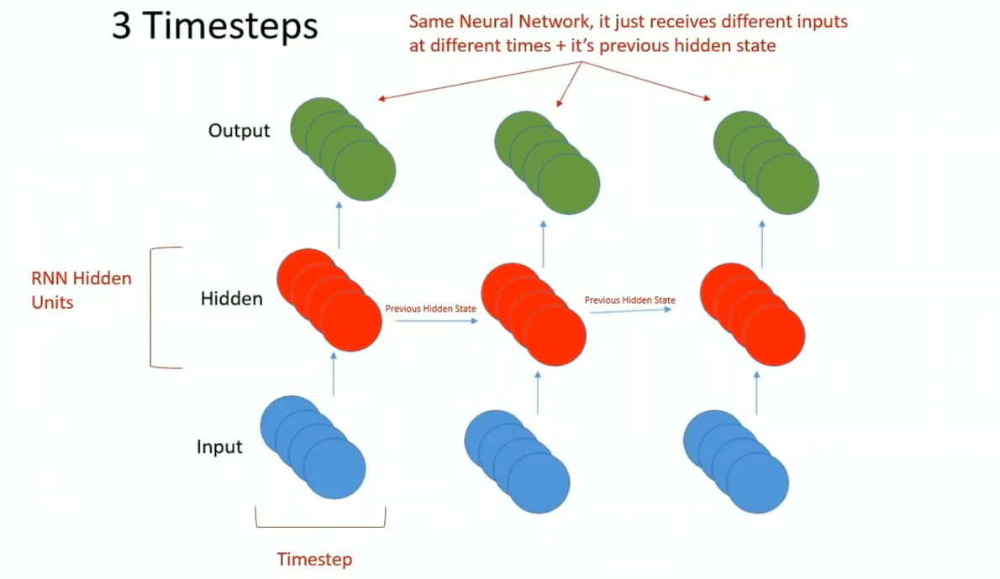
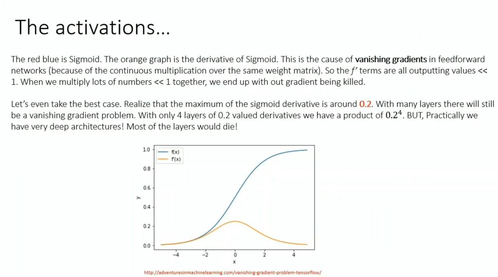
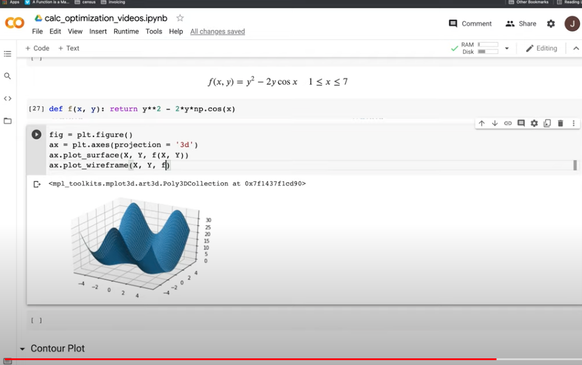

# RNN: recurrent neural networks
RNNs and LSTMs
- used for time series analysis
- stock price predicition: can't predict price based on current month based on one input. Need to observe trend data previously
- text generation: can't predict next word based on previous word: need to see whole sentence as context.
- Think of RNNs as having "memory," and they make predictions based on this memory

RNNs are multiple copies of the same network that recieve inputs at different times as well as its previous hidden state.


Time steps are how many times you copy the network.  Passes the hidden state or output of the hidden neurons to the next neural network

## Difference between RNN and normal feed foward neural networks.

Pic below: input layer (4 input neurons) -> hidden (3 hidden neurons) layer  -> output layer (2 output neurons)


Were going to take this network and flip it and pack it up (represent it as multidimension)


4, 3, and 2 dimensions.

Next represent multidimensional neurons as one neuron



Next, copy the network 5 times



Here you're passing info from one neural network to another, from one timestep to another.  this is what we have when going in depth of the visualization



# The Activation function


We need activation functions to introduce **non linearity**.  If we don't use activations in our functions it'll just be linear.  Sigmoid function converts linear output to a value between zero and one.  Any input that's passed to a sigmoid function will have a value between 0 and 1

Sigmoid function:

$$
\sigma(x) = \frac{1}{1+e^{-x}}
$$

The derivative:
$$
\frac{d}{dx}\sigma(x) = \sigma(x)(1-\sigma(x))
$$

## Derivation

$$
\frac{d}{dx}\sigma(x) = \frac{d}{dx}\bigg[\frac{1}{1+e^{-x}}\bigg]
$$

$$
= \frac{d}{dx}(1+e^{-x})^{-1}
$$

Finish this later

See Asides at the end for how to plot sigmoid function in R/python/Jupyter


---
### Aside
[Plotting sigmoid function in R](https://helloacm.com/quick-r-tutorial-how-to-plot-sigmoid-function-using-r/)

[Plotting sigmoid function in python/jupyter](http://karlrosaen.com/ml/notebooks/logistic-regression-why-sigmoid/)

[Plotting 3d fucntions with matplotlib](https://www.youtube.com/watch?v=_bBSgvixkOc)

```python
import numpy as np

def f(x,y): return y**2 - 2*y*np.cos(x)

fig = plt.figure()
ax = plt.axes(projection='3d')
```
